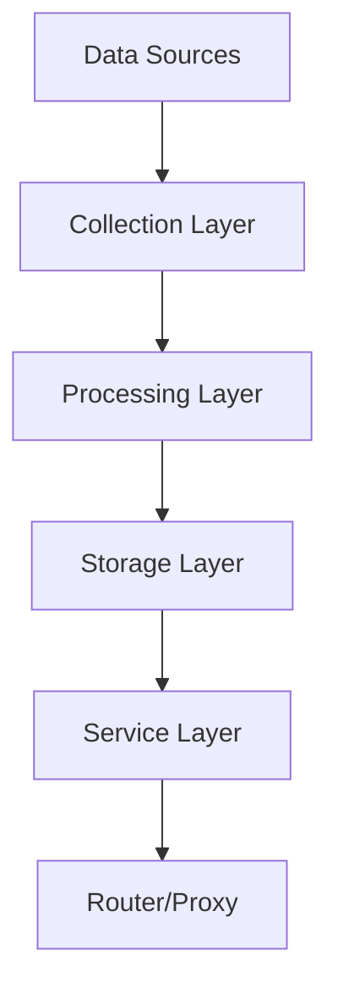

# Data Collection Architecture (Phase 2.1)

## Overview

The data collection pipeline aggregates LLM provider information, model performance metrics, and benchmark data from multiple sources to power the intelligent routing and model selection systems.

## Architecture Components



## 1. Data Sources

### 1.1 Artificial Analysis API
- **Purpose**: Real-time benchmark data and model intelligence indices
- **Endpoint**: `https://artificialanalysis.ai/api/v2/data/llms/models`
- **Data**: Performance metrics, pricing, evaluations
- **Update Frequency**: 24-hour cache (`CACHE_DURATION_HOURS`)
- **File**: `src/rotator_library/fetch_artificial_analysis_data.py`

### 1.2 Provider Database (Static)
- **Purpose**: Provider configurations, rate limits, capabilities
- **Format**: YAML
- **File**: `config/providers_database.yaml`
- **Update**: Manual curation

### 1.3 Live Scrapers
- **Purpose**: Dynamic provider status, availability, pricing updates
- **Components**: 
  - `src/rotator_library/live_scraper.py`
  - `src/rotator_library/leaderboard_updater.py`
- **Targets**: Provider dashboards, status pages, leaderboards

## 2. Collection Layer

### API Fetchers
- **Primary**: `fetch_artificial_analysis_data.py`
  - Handles authentication via environment variables (`ARTIFICIAL_ANALYSIS_API_KEY`)
  - Implements caching to prevent API abuse
  - Error handling with graceful degradation
  - Data flattening for nested structures (evaluations, pricing, model_creator)

### Scrapers
- **Live Scraper**: Real-time data extraction from provider websites
- **Cooldown Management**: Prevents rate limiting via `cooldown_manager.py`

## 3. Processing Layer

### Data Transformation
- **Flattening**: Nested JSON objects converted to flat CSV structure
  - `evaluations` → `eval_{key}`
  - `pricing` → `price_{key}`
  - `model_creator` → `model_creator_name`, `model_creator_slug`
- **Sorting**: Intelligence index descending (primary sort key)
- **Validation**: Type checking and null handling

### Aggregation
- **Leaderboard**: `llm_aggregated_leaderboard.py` combines multiple sources
- **Model Definitions**: `model_definitions.py` normalizes model identifiers

## 4. Storage Layer

### File Formats

| Data Type | Format | Location | Cache Strategy |
|-----------|--------|----------|----------------|
| Benchmarks | CSV | `artificial_analysis_models.csv` | 24h timestamp |
| Providers | YAML | `config/providers_database.yaml` | Version controlled |
| Rankings | YAML | `config/model_rankings.yaml` | Runtime updated |
| Virtual Models | YAML | `config/virtual_models.yaml` | Generated |

### Cache Management
- **Timestamp Files**: `last_successful_fetch.txt` tracks update times
- **Validation**: `is_cache_valid()` checks duration before fetching
- **Fallback**: Uses existing CSV if API fails

## 5. Service Layer

### Model Info Service
- **File**: `src/rotator_library/model_info_service.py`
- **Purpose**: Abstracts data access for router components
- **Interface**: Unified API for model metadata, scores, and capabilities

### Background Refresh
- **File**: `background_refresher.py`
- **Mechanism**: Async updates without blocking requests
- **Health**: Integration with `health_checker.py` for data freshness

## Data Flow

### Fresh Data Ingestion
1. **Trigger**: Cache expiry or manual refresh
2. **Fetch**: API call with authentication headers
3. **Process**: JSON → Flattened dict → Sort → DataFrame
4. **Persist**: CSV write with UTF-8 encoding
5. **Timestamp**: Update `last_successful_fetch.txt`
6. **Notify**: Service layer reloads data

### Runtime Access
1. Router requests model ranking
2. Service layer checks memory cache
3. If stale: trigger background refresh
4. Return current data (stale or fresh)

## Configuration

### Environment Variables
```bash
ARTIFICIAL_ANALYSIS_API_KEY=xxx  # Required for benchmark data
```

### Key Configuration Files
- `config/scoring_config.yaml`: Weights for ranking algorithms
- `config/router_config.yaml`: Data source priorities
- `config/aliases.yaml`: Model name normalization

## Error Handling

### Graceful Degradation
- API failure → Use existing CSV
- Parse error → Skip record, continue processing
- Missing fields → Default to `-inf` for sorts

### Monitoring
- **Logs**: `src/rotator_library/failure_logger.py`
- **Health Checks**: Data freshness validation
- **Alerts**: Failed fetch notifications

## Integration Points

### Router Core (`router_core.py`)
- Consumes aggregated rankings
- Uses provider database for capability filtering
- Respects rate limits from provider configs

### Provider Adapters
- `provider_adapter.py`: Normalizes provider-specific APIs
- `provider_factory.py`: Instantiates clients based on database config

## Security Considerations

- API keys stored in `.env` (never committed)
- No sensitive data in CSV exports
- Rate limiting on outbound requests
- Input validation on scraped data

## Maintenance

### Adding New Data Sources
1. Create fetcher in `src/rotator_library/`
2. Define schema in `config/`
3. Update service layer interface
4. Document in this architecture doc

### Data Quality
- Automated validation in `process_api_data()`
- Manual verification fields (`last_verified`) in provider configs
- Cross-reference validation between sources
